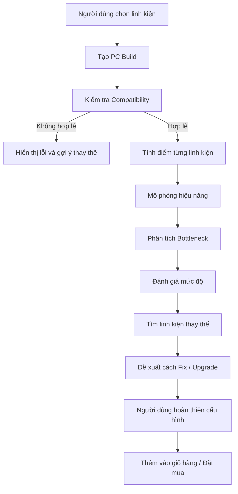

# 🖥️ Bán Linh Kiện & Mô Phỏng PC

Website bán linh kiện máy tính kết hợp công cụ **xây dựng và mô phỏng cấu hình PC**.

Khác với một website bán linh kiện thông thường, hệ thống không chỉ giúp người dùng chọn và mua sản phẩm mà còn hỗ trợ kiểm tra khả năng tương thích giữa các linh kiện, mô phỏng hiệu năng của cấu hình và dự đoán **bottleneck (nghẽn cổ chai)**. Từ kết quả phân tích, hệ thống sẽ đưa ra các gợi ý thay đổi hoặc nâng cấp linh kiện phù hợp.

---

## 🎯 Mục tiêu dự án

Xây dựng một website hỗ trợ người dùng:

- Tìm kiếm và mua linh kiện PC.
- Tự xây dựng một bộ PC từ các linh kiện đang được bán trên website.
- Kiểm tra tính tương thích giữa các linh kiện.
- Mô phỏng tương đối hiệu năng của cấu hình.
- Phát hiện linh kiện có khả năng gây bottleneck.
- Giải thích nguyên nhân gây bottleneck.
- Đưa ra phương án thay thế hoặc nâng cấp linh kiện.
- Gợi ý cấu hình phù hợp với ngân sách và nhu cầu sử dụng.

---

## 💡 Ý tưởng chính

Luồng sử dụng cơ bản:

```text
Chọn linh kiện
      ↓
Tạo cấu hình PC
      ↓
Kiểm tra tương thích
      ↓
Mô phỏng hiệu năng
      ↓
Phân tích bottleneck
      ↓
Đưa ra cảnh báo
      ↓
Gợi ý cách khắc phục / nâng cấp
      ↓
Hoàn thiện cấu hình và đặt mua
```

Ví dụ:

> Người dùng chọn một CPU tầm trung nhưng ghép với GPU quá mạnh.

Hệ thống có thể đưa ra kết quả:

```text
⚠ Có khả năng xảy ra bottleneck ở CPU.

CPU hiện tại có thể giới hạn hiệu năng của GPU
trong các tác vụ hoặc game phụ thuộc nhiều vào CPU.

Gợi ý:
- Nâng cấp CPU.
- Chọn GPU thấp hơn để cân bằng chi phí.
- Giữ cấu hình hiện tại nếu chủ yếu chơi game ở độ phân giải cao.
```

---

## 🛒 1. Website bán linh kiện PC

Website quản lý và bán các nhóm sản phẩm như:

- CPU
- GPU / Card đồ họa
- Mainboard
- RAM
- SSD / HDD
- PSU / Nguồn
- Case
- Tản nhiệt
- Màn hình
- Các phụ kiện khác

Mỗi sản phẩm có thể bao gồm:

- Tên sản phẩm
- Hãng sản xuất
- Giá
- Hình ảnh
- Thông số kỹ thuật
- Tình trạng hàng
- Bảo hành
- Mô tả
- Nhóm sản phẩm
- Các thuộc tính dùng để kiểm tra tương thích và mô phỏng

---

## 🧩 2. PC Builder

Người dùng có thể chọn linh kiện trực tiếp từ sản phẩm đang bán trên website để tạo thành một cấu hình hoàn chỉnh.

Ví dụ:

| Thành phần | Linh kiện |
|---|---|
| CPU | AMD Ryzen 5 7600 |
| GPU | RTX 4070 |
| Mainboard | B650 |
| RAM | 32GB DDR5 |
| SSD | 1TB NVMe |
| PSU | 750W |
| Case | Mid Tower |

Hệ thống tự động tính:

- Tổng giá cấu hình.
- Tổng công suất ước tính.
- Khả năng tương thích.
- Mức cân bằng giữa các linh kiện.

---

## 🔌 3. Kiểm tra tương thích linh kiện

Trước khi mô phỏng hiệu năng, hệ thống kiểm tra các lỗi cơ bản trong cấu hình.

### CPU ↔ Mainboard

Kiểm tra:

- Socket.
- Chipset.
- Khả năng hỗ trợ CPU.
- Các giới hạn liên quan nếu có.

### RAM ↔ Mainboard

Kiểm tra:

- DDR4 / DDR5.
- Dung lượng hỗ trợ.
- Số khe RAM.
- Bus RAM.

### GPU ↔ Case

Kiểm tra:

- Kích thước card.
- Không gian lắp đặt.

### PSU ↔ Cấu hình

Kiểm tra:

- Công suất nguồn.
- Mức tiêu thụ điện ước tính.
- Khoảng công suất dự phòng.

### Tản nhiệt ↔ CPU / Case

Kiểm tra:

- Socket hỗ trợ.
- Khả năng đáp ứng mức nhiệt.
- Kích thước tản nhiệt.

---

## 📊 4. Mô phỏng cấu hình

Sau khi cấu hình hợp lệ, hệ thống sử dụng thông số của từng linh kiện để tạo ra đánh giá tương đối.

Một số yếu tố có thể được sử dụng:

### CPU

- Số nhân / luồng.
- Xung nhịp.
- Kiến trúc.
- Cache.
- Điểm benchmark tham khảo.

### GPU

- VRAM.
- Kiến trúc.
- Điểm benchmark.
- Hiệu năng rasterization.
- Khả năng xử lý ở các độ phân giải khác nhau.

### RAM

- Dung lượng.
- Bus.
- Số channel.

### Storage

- Loại ổ cứng.
- Chuẩn kết nối.
- Tốc độ đọc / ghi.

### PSU

- Công suất.
- Hiệu suất.
- Mức công suất dự phòng.

Kết quả mô phỏng không nhằm thay thế benchmark thực tế mà dùng để **so sánh, cảnh báo và hỗ trợ người dùng chọn cấu hình hợp lý hơn**.

---

## 🚧 5. Phân tích Bottleneck

Bottleneck xảy ra khi một thành phần trong hệ thống giới hạn khả năng hoạt động của các thành phần khác.

Ví dụ:

```text
CPU yếu + GPU mạnh
        ↓
CPU xử lý không kịp
        ↓
GPU không được sử dụng hết
        ↓
Hiệu năng thực tế thấp hơn khả năng của GPU
```

Hệ thống sẽ phân tích các mối quan hệ như:

- CPU ↔ GPU
- CPU ↔ RAM
- GPU ↔ độ phân giải
- RAM ↔ workload
- Storage ↔ tác vụ
- PSU ↔ tổng công suất

---

## 🧠 6. Dự đoán mức độ Bottleneck

Kết quả có thể được chia thành nhiều mức:

| Mức | Ý nghĩa |
|---|---|
| 🟢 Tốt | Cấu hình tương đối cân bằng |
| 🟡 Nhẹ | Có chênh lệch nhưng vẫn sử dụng tốt |
| 🟠 Trung bình | Một linh kiện có thể giới hạn hiệu năng đáng kể |
| 🔴 Cao | Nên cân nhắc thay đổi cấu hình |

Ví dụ:

```text
CPU: Ryzen 5 3600
GPU: RTX 4080

Kết quả:
Bottleneck dự kiến: CPU

Mức độ: Cao

Nguyên nhân:
CPU có hiệu năng thấp hơn đáng kể so với khả năng
xử lý đồ họa của GPU trong một số workload.
```

> Phần trăm bottleneck nếu được sử dụng chỉ nên được xem là giá trị ước lượng, không phải kết quả benchmark tuyệt đối.

---

## 🛠️ 7. Gợi ý cách khắc phục

Đây là phần quan trọng nhất của hệ thống.

Website không chỉ báo:

> "Cấu hình bị bottleneck."

mà còn phải trả lời:

> "Tại sao bị bottleneck và nên thay đổi gì?"

Ví dụ:

### Trường hợp CPU Bottleneck

Hệ thống có thể gợi ý:

- Nâng cấp CPU.
- Chọn CPU có hiệu năng đơn nhân cao hơn.
- Chọn GPU thấp hơn để tiết kiệm chi phí.
- Giữ nguyên GPU nếu người dùng có kế hoạch nâng cấp CPU sau.

### Trường hợp GPU Bottleneck

Gợi ý:

- Nâng cấp GPU.
- Giảm thiết lập đồ họa.
- Sử dụng công nghệ upscale nếu phù hợp.
- Giảm độ phân giải.

### Trường hợp thiếu RAM

Gợi ý:

```text
RAM hiện tại: 8GB
Khuyến nghị: 16GB

→ Có thể nâng cấp thêm một thanh RAM tương thích.
```

### Trường hợp PSU không đủ

Gợi ý:

```text
Công suất cấu hình ước tính: 610W
PSU hiện tại: 600W

⚠ Công suất dự phòng quá thấp.

Khuyến nghị:
750W hoặc cao hơn.
```

---

## 💰 8. Gợi ý nâng cấp theo ngân sách

Hệ thống có thể đưa ra nhiều phương án thay vì chỉ một lựa chọn.

Ví dụ:

### Tiết kiệm

```text
Giữ CPU
Đổi RTX 4070 → RTX 4060 Ti

Chi phí giảm: ...
Mức cân bằng tốt hơn.
```

### Cân bằng

```text
Đổi CPU → Ryzen 5 7600
Giữ RTX 4070

Chi phí tăng: ...
Hiệu năng dự kiến tăng: ...
```

### Tối ưu hiệu năng

```text
CPU → Ryzen 7 ...
GPU → ...
RAM → 32GB

Phù hợp với gaming / render / workload nặng.
```

---

## 🎮 9. Gợi ý theo nhu cầu sử dụng

Người dùng có thể chọn mục đích:

- Gaming
- Gaming 1080p
- Gaming 1440p
- Gaming 4K
- Văn phòng
- Học tập
- Lập trình
- Đồ họa
- Render
- Streaming
- AI / Machine Learning

Thuật toán đánh giá sẽ thay đổi trọng số tùy mục đích.

Ví dụ:

```text
Gaming 1080p
→ CPU có ảnh hưởng lớn hơn.

Gaming 4K
→ GPU thường trở thành yếu tố quan trọng hơn.

Render
→ CPU đa nhân, GPU và RAM có thể được ưu tiên.

Văn phòng
→ Không cần GPU quá mạnh.
```

---

## 🤖 10. Hệ thống Recommendation

Từ cấu hình hiện tại, hệ thống có thể tìm sản phẩm khác trong database để đề xuất.

Ví dụ:

```text
CPU hiện tại
    ↓
Phân tích socket + chipset
    ↓
Tìm CPU tương thích
    ↓
Lọc theo giá
    ↓
So sánh hiệu năng
    ↓
Đề xuất lựa chọn tốt hơn
```

Mỗi gợi ý cần đảm bảo:

- Tương thích với cấu hình.
- Nằm trong ngân sách.
- Giảm bottleneck.
- Có cải thiện hợp lý về hiệu năng.
- Là sản phẩm đang tồn tại trong hệ thống.

---

## 👤 11. Chức năng người dùng

Người dùng có thể:

- Đăng ký.
- Đăng nhập.
- Xem sản phẩm.
- Tìm kiếm sản phẩm.
- Lọc sản phẩm.
- Xem chi tiết sản phẩm.
- Thêm sản phẩm vào giỏ hàng.
- Tạo cấu hình PC.
- Lưu cấu hình.
- Chỉnh sửa cấu hình.
- Phân tích cấu hình.
- Xem gợi ý nâng cấp.
- Đặt hàng.
- Xem lịch sử đơn hàng.

---

## 🔐 12. Chức năng quản trị

Admin có thể:

- Quản lý tài khoản.
- Quản lý sản phẩm.
- Quản lý danh mục.
- Quản lý thông số linh kiện.
- Quản lý tồn kho.
- Quản lý đơn hàng.
- Quản lý dữ liệu benchmark.
- Quản lý các luật tương thích.
- Quản lý dữ liệu dùng cho thuật toán bottleneck.

---

## 🧮 Ý tưởng thuật toán Bottleneck

Phiên bản đầu có thể sử dụng **rule-based system** thay vì AI.

Ví dụ:

```text
CPU_SCORE = điểm hiệu năng CPU
GPU_SCORE = điểm hiệu năng GPU

ratio = CPU_SCORE / GPU_SCORE
```

Sau đó kết hợp với:

- Độ phân giải.
- Mục đích sử dụng.
- RAM.
- Số nhân CPU.
- VRAM.
- Benchmark thực tế.

Pseudo-code:

```text
if CPU quá yếu so với GPU:
    bottleneck = CPU

else if GPU quá yếu so với CPU:
    bottleneck = GPU

else:
    bottleneck = Balanced
```

Sau này có thể phát triển thành:

```text
Benchmark Dataset
       ↓
Data Processing
       ↓
Scoring Model
       ↓
Bottleneck Prediction
       ↓
Recommendation Engine
```

---

## 🗃️ Dữ liệu cần lưu

### Product

```text
id
name
category
brand
price
stock
description
image
```

### CPU

```text
socket
cores
threads
base_clock
boost_clock
tdp
benchmark_score
```

### GPU

```text
vram
tdp
length
benchmark_score
```

### Mainboard

```text
socket
chipset
ram_type
max_ram
```

### RAM

```text
type
capacity
speed
```

### PSU

```text
wattage
efficiency
```

### PC Build

```text
user_id
cpu_id
gpu_id
mainboard_id
ram_id
storage_id
psu_id
case_id
cooler_id
total_price
```

---

## 🔄 Quy trình phân tích cấu hình



---

## 🚀 Hướng phát triển

Các phiên bản sau có thể bổ sung:

- Benchmark database.
- So sánh FPS theo game.
- Ước tính FPS ở 1080p / 1440p / 4K.
- Ước tính điện năng tiêu thụ.
- Ước tính nhiệt độ.
- Chấm điểm Price / Performance.
- Auto Build PC theo ngân sách.
- Gợi ý cấu hình bằng AI.
- So sánh hai cấu hình.
- Chia sẻ cấu hình bằng link.
- Cộng đồng đánh giá cấu hình.
- Theo dõi lịch sử giá linh kiện.

---

## ⚠️ Lưu ý

Kết quả mô phỏng và bottleneck chỉ mang tính **ước lượng và hỗ trợ lựa chọn linh kiện**.

Hiệu năng thực tế còn phụ thuộc vào nhiều yếu tố:

- Game / phần mềm.
- Độ phân giải.
- Setting.
- Driver.
- Hệ điều hành.
- Nhiệt độ.
- BIOS.
- RAM.
- Tản nhiệt.
- Khả năng boost của CPU/GPU.

Vì vậy hệ thống không nên khẳng định một con số bottleneck là chính xác tuyệt đối.

---

## 📌 Tóm tắt

**Bán Linh Kiện & Mô Phỏng PC** hướng tới việc kết hợp ba hệ thống trong cùng một website:

```text
E-Commerce
    +
PC Builder
    +
PC Performance Advisor
```

Người dùng không chỉ **mua linh kiện**, mà còn có thể biết:

- Các linh kiện có lắp được với nhau hay không.
- Cấu hình có cân bằng hay không.
- Thành phần nào đang giới hạn hiệu năng.
- Vì sao xảy ra bottleneck.
- Nên thay linh kiện nào.
- Phương án nào phù hợp nhất với ngân sách và nhu cầu.
